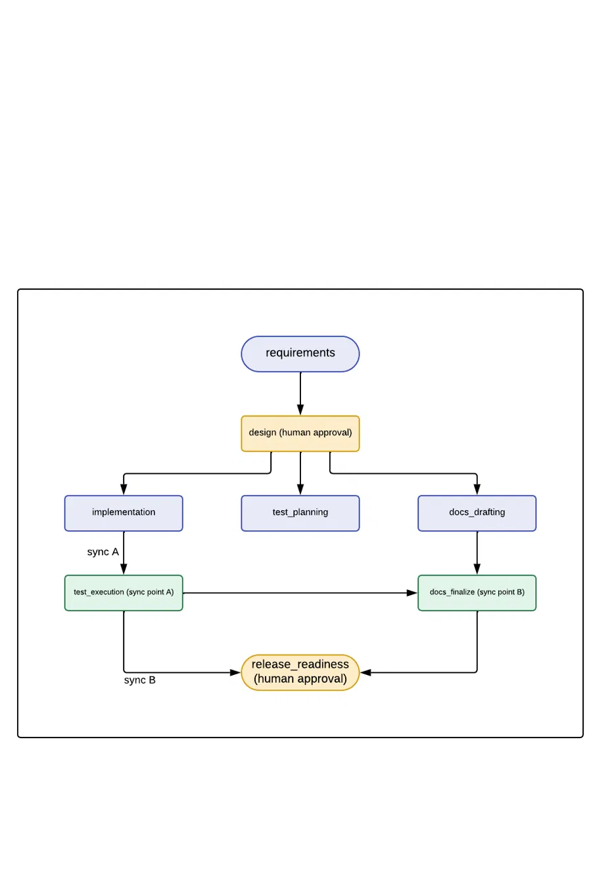

# URL Shortener — Agentic SDLC Orchestration

A working prototype of an agentic orchestration layer that coordinates a full
SDLC pipeline — requirements → design → implementation/test-planning/docs-drafting
(parallel) → test-execution → docs-finalize → release-readiness — with real
entry/exit gates, blocking human-approval checkpoints, bounded retry/fallback/
rollback, and an audit log + metrics tracker. The orchestrator uses that pipeline
to actually build a URL shortener service, stage by stage, across three scenarios:
a greenfield feature, a brownfield extension, and one genuinely ambiguous
requirement.

The orchestration layer (`orchestrator/`) is the graded differentiator; the
shortener (`service/`) is a demonstration artifact the orchestrator produces,
not hand-written separately. See [`FINAL_SUMMARY.md`](FINAL_SUMMARY.md) for the
plan/rationale/risks/assumptions write-up, and
[`design-log.md`](design-log.md) for the full decision-lineage record this
project was built against (locked stage graph, state schema, gates, retry
rules, and per-scenario notes).



---

## Setup

Requires Python 3.11+ (developed against 3.14).

```bash
python3 -m venv .venv
.venv/bin/pip install -r requirements.txt
```

## Running the orchestrator

```bash
.venv/bin/python cli.py run --requirement "Build a URL shortener with core APIs, analytics, and reliability features"
```

This starts a new run and walks the full 8-stage graph. It will pause twice for
human approval — at the `design` exit gate and the `release_readiness` exit gate
(see [`design-log.md` Section 5](design-log.md)) — and block on stdin:

```
[design] approve / reject (with reason)? >
```

Type `approve` to continue, or `reject <reason>` to trigger an immediate
rollback + safe-stop (the run's `overall_status` becomes `blocked`).

Each run produces `runs/<run_id>/state.json` (the full Section 3 state schema:
stage statuses, requirement normalization, decisions, artifacts, retry counts,
approvals, metrics) and `runs/<run_id>/audit.log` (an append-only line per
transition). Both are plain text — open them directly to see exactly what the
run did and why.

### Running a scenario

The `requirements` stage matches keywords in `--requirement` to select which
scenario-specific normalization/design/test/doc branch runs (see
`orchestrator/stages/requirements.py`). Examples used during development:

```bash
# Greenfield: custom aliases
.venv/bin/python cli.py run --requirement "Add support for custom aliases so users can choose their own short link instead of a generated one"

# Brownfield: link expiration / TTL
.venv/bin/python cli.py run --requirement "Add link expiration (TTL) so short links can automatically expire"

# Ambiguous: disambiguated live in the run's decision log, see design-log.md Section 8
.venv/bin/python cli.py run --requirement "Make it more reliable"
```

Any requirement text not matching a known scenario falls back to a generic
normalization rather than failing.

## Running the service directly

Once a run has built `service/app/`, it's a normal FastAPI app:

```bash
.venv/bin/uvicorn service.app.main:app --port 8000
```

```bash
curl -X POST localhost:8000/api/links -H "Content-Type: application/json" \
  -d '{"long_url": "https://example.com/some/long/path"}'
# {"alias":"aZ3kq9x","short_url":"/aZ3kq9x","long_url":"...","created":true,"expires_at":null}

curl -i localhost:8000/aZ3kq9x        # 302 redirect
curl localhost:8000/api/links/aZ3kq9x/stats
curl localhost:8000/healthz
```

## Testing

```bash
.venv/bin/python -m pytest tests/ service/tests/ -v
```

- `tests/test_orchestrator.py` — unit tests for the graph runner against
  synthetic graphs: gate logic, retry-within-budget, retry-exhausted,
  fallback-used, rollback scoped to a single stage (siblings + audit history
  untouched), and genuine parallel execution (measured via wall-clock overlap,
  not just an execution-order assertion).
- `service/tests/test_api.py` — real integration tests against the FastAPI app
  (via `TestClient` and a temporary SQLite DB), written by the orchestrator's
  own `test_execution` stage and actually run as part of every pipeline run,
  not added by hand afterward.

## Project layout

```
orchestrator/            # the orchestration engine — the graded differentiator
  state.py                 # Section 3 state schema (dataclasses + JSON persistence)
  graph.py                 # Section 2 stage graph, as data; plan_for() dynamically re-plans it
  gates.py                 # Section 4 entry/exit gate predicates
  retry.py                 # Section 6 retry/fallback/rollback policy
  approval.py               # Section 5 blocking human-approval checkpoint
  audit.py                  # Section 7 audit log + metrics
  runner.py                 # the engine: parallel scheduling, retry loop, rollback
  demo_stages.py             # Step-2 no-op stub handlers (superseded by stages/, kept for reference)
  stages/                   # real stage handlers — build the shortener stage by stage
    requirements.py           # requirement normalization, incl. ambiguous-scenario disambiguation
    design.py, test_planning.py, docs_drafting.py, docs_finalize.py, release_readiness.py
    implementation.py         # copies+compiles service_app/ templates into service/app/
    migration_review.py       # conditionally inserted by plan_for(); verifies real db.py migration
    test_execution.py         # copies service_tests/ template, actually runs pytest
    templates/                # the actual service source, applied by the stages above
      service_app/              # FastAPI app: db, shortener, analytics, models, main
      service_tests/            # the real pytest suite
service/                  # built BY the orchestrator, not hand-written
  app/                      # the FastAPI service (copied from orchestrator/stages/templates/)
  tests/                    # real pytest suite + TEST_PLAN.md (written by the pipeline)
  docs/                     # DESIGN.md + API.md (written by the pipeline)
runs/<run_id>/            # one directory per orchestration run: state.json + audit.log
tests/test_orchestrator.py  # unit tests for the orchestration engine itself
tests/test_replanning.py    # unit tests for plan_for()'s dynamic re-planning
cli.py                    # entrypoint: python cli.py run --requirement "..."
design-log.md             # locked stage graph/schema/gates + full scenario decision log
FINAL_SUMMARY.md          # plan/rationale/artifacts/risks/assumptions/limitations
```

## Limitations

See [`design-log.md` Section 9](design-log.md) for the full running list
(no rate limiting, in-memory orchestration-run state, SQLite's single-writer
ceiling, no background TTL sweep, no auth/ownership, CLI-blocking approval
checkpoints, no resume-from-run-id). None of these are hidden — each was
surfaced explicitly at the point it became relevant, not discovered after the
fact.
